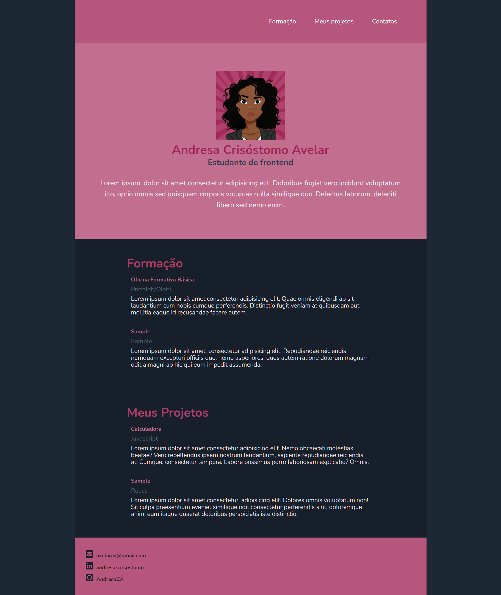

# Portfólio do Módulo I do Ciclo Formativo básico - Pretalab

[Link do projeto no Netlify](https://portfolio-andresa-crisostomo-avelar.netlify.app/)

Ainda em fase de construção, será atualizado com os conteudos das aulas de Javascript e React.

## Tecnologias usadas
- HTML
- CSS

